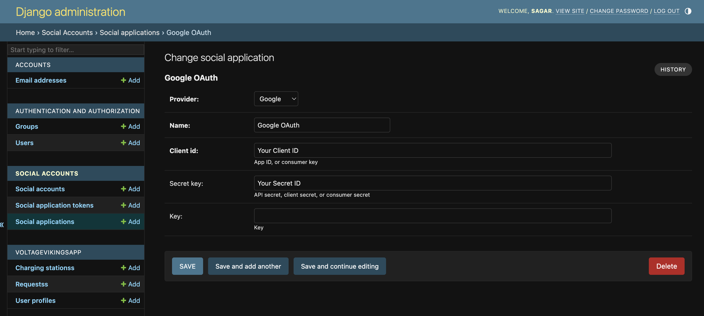

# Team Code - S06
# Team - Voltage Vikings
# EV CONNECT
# Description
- Web application which connects two electric vehicles owners where one owner has a charging port installed at his house and another  is looking for a charging point for his vehicle but does not have a port in his house.
- It connects these two owners and solves the problem of charging station deficiency.
- It recommends the owners based on their location and charging port power.
- This application has the potential to bring up more electric vehicles in to the society and solve the problem of charging station deficiency
# Tech Stack:
- Backend
  -  Python, Django Framework
- Frontend 
  - HTML
  - CSS
  - Javascript
- API's
  -  Google Maps, Razor Pay, Google OAuth Consent Screen
# Libraries and Dependencies
- Pychram/VS Code
- Google Map API Key
- Google OAuth API Key
- Razor Pay API Key
- Gmail App Password
- Required Module Are In The requiements.txt
# Installation Steps
- Clone This Repository Using command
  -  `git clone https://github.com/amsagar/S06.git`
  - Create and Activate Your Virtual Environment In The Project Directory Using Commands
  - python -m <your_venv_name> .  (Creation Of Virtual Environment) 
  - source bin/activate (Activate Your Virtual Environment)
- Now Go To Project Folder Find The `settings.py` File Open It And Make The Neccessary Changes Shown Below
  - EMAIL_HOST_USER = 'your mail id'
  - EMAIL_HOST_PASSWORD = "your app password"
  - GOOGLE_API_KEY = "your api key"
  - RAZOR_PAY_API_KEY = "your razor pay api key"
  - RAZOR_PAY_SECRET_KEY = "your razor pay secret key"
- Open The Terminal In Your Project Directory Make Sure Two Things
  - Your In The `BASE_DIR` Of The Project
    - Tip: Where You Will Find The File `manage.py`
  - Your `venv`(Virtual Environment) Is Activated
    - Tip: Your Terminal Prompt Should Look Like This `(your_virtual_environment name) path/to/your/project/ %` 
  - Now All Done You Are Ready With The Project Configuration. Now Run The Following Command In The Terminal
    - `pip install -r requirements.txt`
    - `python manage.py makemigrations`
    - `python manage.py migrate`
    - `python manage.py createsuperuser` - Create Admin Account Here
    - `python manage.py runserver`
    - If You Face Issues In Loading Static Files Like CSS, Javascript Then Run The Below Command
      - `python manage.py collectstatic` 
  - Your Project Will Be Running At `localhost` Head On To Link http://127.0.0.1:8000/
  - To Access The Admin Account Head On To Link http://127.0.0.1:8000/admin And Login With username and password Given While Creating Superuser
  - And Also Its Important To Ensure That The Social Application Provider Is Configured With The Neccessary Keys In The Admin Panel Just As Shown Below
    - 